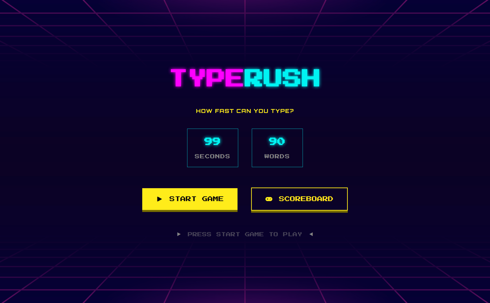

# TypeRush



## Collaborators:

- Oghenefejiro Stephanie Abere
- Roopjeet Kaur

## Description

**TypeRush** is a fast-paced typing game designed to improve typing speed, accuracy, and focus in a fun and interactive environment. The interface features an **arcade-inspired** design, giving the game a retro feel while enhancing user engagement.

Developed as part of an Object-Oriented JavaScript course, TypeRush showcases clean architecture, real-time UI updates, modular JavaScript, and interactive gameplay.

## Features

- 99‑second timed challenge
- Real‑time typing accuracy tracking
- Randomized word generation
- Restart game functionality
- Game statistics and performance metrics
- Sound effects and background music
- Fully responsive design (desktop, tablet, mobile)
- Modern neon dark theme
- Smooth transitions between game screens
- Scoreboard to track previous results

## Game Screens

- Start Game Screen
- Typing Screen
- End Game Screen
- Scoreboard Screen

## Technologies Used

### Front-end

- HTML5
- CSS
- JavaScript

### Concepts Applied

- Object‑Oriented Programming (OOP)
- DOM Manipulation
- Event Handling
- Timer Functions
- Array Manipulation
- Modular JavaScript

### Tools/Services

- VS Code
- Git/GitHub

## Key Implementation Details

### Class‑Based Architecture

The application uses JavaScript classes (such as Score) to organize logic and maintain clean, reusable code.

### Real‑Time Typing Validation

Each letter is validated as the user types, providing instant feedback using color indicators and animations.

```js
inputField.addEventListener("input", (e) => {
  const letters = document.querySelectorAll(".displayed-word span");
  const typed = e.target.value.trim().split("");

  letters.forEach((letter, index) => {
    if (typed[index] === undefined) {
      letter.classList.remove("correct", "wrong");
    } else if (typed[index].toLowerCase() === letter.textContent.toLowerCase()) {
      letter.classList.add("correct");
      letter.classList.remove("wrong");
    } else {
      playErrorSound();
      letter.classList.add("wrong");
      letter.classList.remove("correct");
      animate(wordDisplayContainer, "input-error", 300);
    }
  });

  checkAllMatched();
});
```

### Word Randomization

Words are shuffled using the Fisher‑Yates Shuffle Algorithm to ensure a different experience every game.

### Timer Logic

A 99‑second countdown timer controls the game session and automatically ends the game when time expires.

```js
const startCountdown = () => {
  displayTimeLeft();

  timer = setInterval(() => {
    timeLeft--;

    if (timeLeft <= 0) {
      clearInterval(timer);
      timeCountdown.textContent = "0s";
      endGame();
      return;
    }
    displayTimeLeft();
  }, 1000);
};
```

### Completion % Calculation

Completion % is calculated based on correctly typed words divided by total words and displayed as part of the final statistics.

### Performance Metrics

Users receive:

- Total points
- Completion percentage
- Average time per word

### Audio Integration

Sound effects include:

- Start game sound
- Correct word sound
- Error sound
- Game over sound
- Background music

### Screen State Management

Different screens are managed dynamically:

- Start Game Screen
- Typing Screen
- End Game Screen
- Scoreboard Screen

## Collaboration & Version Control

This project was developed collaboratively using GitHub:

- Feature branches for development
- Pull requests for merging
- Conflict resolution
- Shared responsibilities for UI and functionality

## Demo

Click [here](https://fejiro001.github.io/type-rush/) to demo
